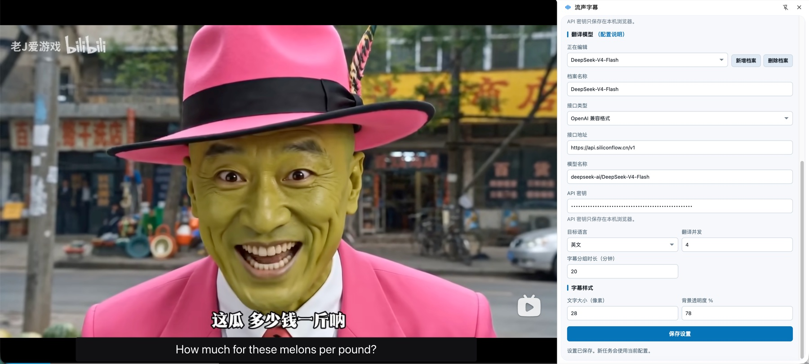
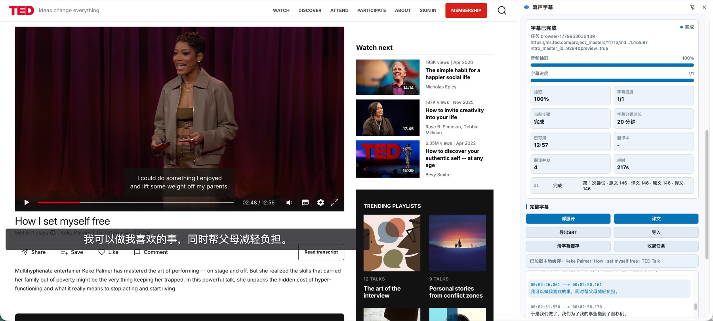
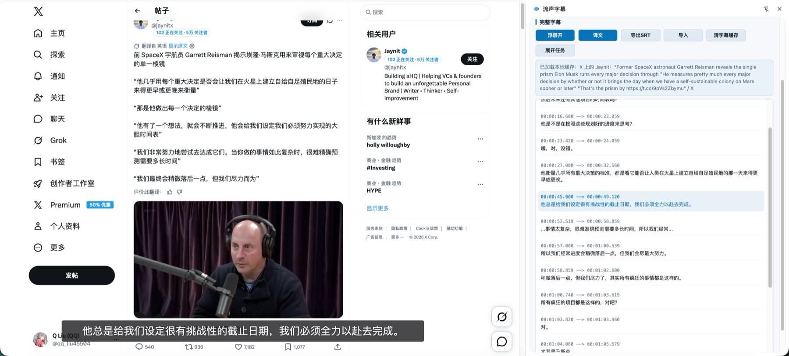
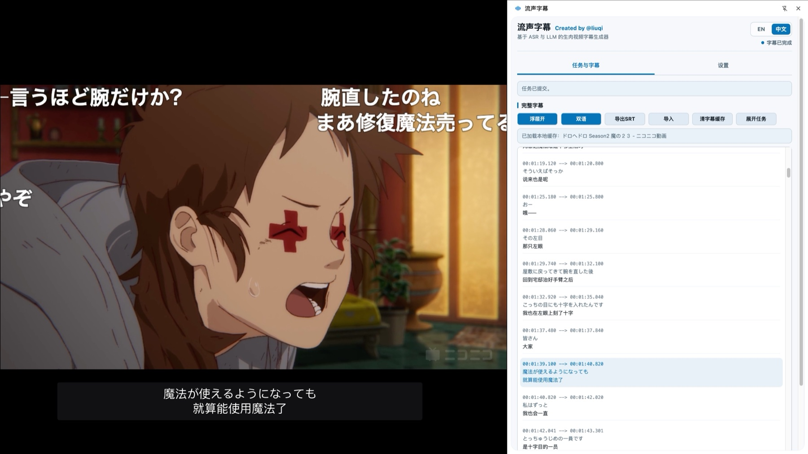

# Liusheng Subtitles - Streaming Video Subtitle Generation and Translation with ASR and LLM

Languages: [简体中文](README.md) · [English](README-en.md)

Liusheng Subtitles is a Chrome extension for generating and translating subtitles for web videos. It is designed for streaming videos that have no subtitles, incomplete subtitles, or foreign-language subtitles that need to be translated into the selected target language.

After opening a video page, Liusheng Subtitles shows available media sources in the side panel. Configure an ASR provider and an LLM translation provider, then generate original subtitles, translated subtitles, or bilingual subtitles and display them on the page.

## Features

- Discover video sources on the current web page.
- Generate original subtitles and translate them into the selected target language.
- Switch between translated text, original text, and bilingual display.
- Show subtitles as a page overlay or in the side-panel subtitle list.
- Import SRT, VTT, ASS/SSA, and extension JSON subtitle files.
- Export subtitles as SRT.
- Cache subtitles locally so the same page can load existing subtitles later.
- Support OpenAI Whisper, Groq Whisper, xAI Grok, Fun-ASR, and custom ASR endpoints.
- Support OpenAI-compatible, Anthropic-compatible, and custom LLM translation endpoints.

## Demo Screenshots

*Bilibili Video / Settings Interface*

*TED Video / Main Interface*

*X / Full Subtitles*

*NicoNico Video / Fullscreen Playback*

## Installation

1. Open `chrome://extensions` in Chrome.
2. Turn on **Developer mode**.
3. Click **Load unpacked**.
4. Select the `extension/` directory in this repository.

## Usage

1. Open a web video page.
2. Open the Liusheng Subtitles side panel.
3. Configure speech recognition and translation providers in **Settings**.
4. In **Tasks & Subtitles**, select a media source and the original audio language.
5. Click **Start Extraction** and wait for subtitles to be generated.
6. After generation, switch between translated, original, or bilingual display, or export the subtitle file.

If a task is interrupted, use **Continue** or **Retry Failed**. To translate again while keeping existing ASR results, use **Retranslate Subtitles**. Use **Re-ASR** only when the original transcription needs to be regenerated.

## Privacy

API keys, model profiles, and subtitle caches are stored in the local browser. The extension does not send web videos, subtitle caches, or API keys to the Liusheng Subtitles developer's server. Audio and subtitle text are sent only to the ASR and translation services configured by the user.

See [Privacy Notice](docs/PRIVACY.md) for details.

## Notes

Liusheng Subtitles is intended for web video content that the user is allowed to access and process. Please follow copyright rules, website terms of service, and platform policies.

Some encrypted, cross-origin restricted, or platform-specific media sources may not be processable.

## Open Source Credits

Thanks to [cat-catch](https://github.com/xifangczy/cat-catch) for browser media-sniffing practices. Browser-side audio processing uses [ffmpeg.wasm](https://github.com/ffmpegwasm/ffmpeg.wasm). Subtitle timing and silence-handling ideas reference public approaches from faster-whisper, WhisperX, stable-ts, and Speaches.

## License

This project is released under the [MIT License](LICENSE).
